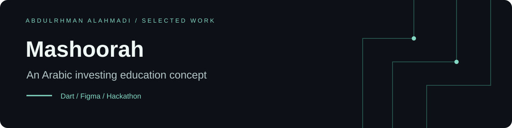
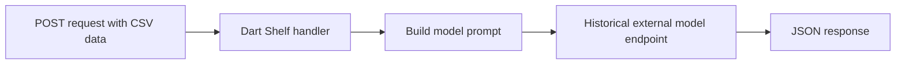

# Mashoorah | مشورة

**An Arabic investing-education concept created for the Saudi ChatGPT hackathon.**

[Figma prototype](https://www.figma.com/file/e2dvZlxdP3IMiOSVi0xJ6E/Mashoorah?node-id=0%3A1) · [Design preview](mashoorah.pdf) · [Dart experiment](main_backend.dart)

## Preview


*Original design preview from the repository PDF; this is a prototype screen, not a screenshot of a deployed application.*

## فكرة المشروع

مشورة فكرة منصة تعليمية لغير المختصين، تساعدهم على فهم تنويع الاستثمارات في سوق الأسهم السعودي وعلاقة العائد بالمخاطر. يضم المستودع التصاميم والعرض التقديمي وتجربة برمجية أولية من الهاكاثون.

## Project story

**Problem.** New investors may find portfolio diversification and the relationship between risk and return difficult to understand.

**Approach.** Explore an Arabic educational experience in Figma and a Dart HTTP experiment that submits CSV context to an external model endpoint.

**Current result.** Design artifacts, a presentation, sample CSV data, and an experimental backend. The archived Flutter app is the starter counter app, not an implemented Mashoorah client. No validated portfolio optimizer or live service is included.

## Experimental backend flow



The implementation reads `user_points` but does not incorporate it into the prompt. The diagram describes the submitted experiment, not an end-to-end working deployment.

## Explore the project

| Artifact | Purpose |
| --- | --- |
| [Figma prototype](https://www.figma.com/file/e2dvZlxdP3IMiOSVi0xJ6E/Mashoorah?node-id=0%3A1) | Original interface concept; access depends on Figma sharing |
| [mashoorah.pdf](mashoorah.pdf) | Design screens available directly in this repository |
| [Hackathon presentation](%D9%85%D8%B4%D9%88%D8%B1%D8%A9%20GPT.pptx) | Original presentation |
| [main_backend.dart](main_backend.dart) | Shelf handler and outbound model request |
| [MSGPT.csv](MSGPT.csv) | Project CSV artifact |
| [app.zip](app.zip) | Archived Flutter starter project |

## Local exploration

The designs and PDF can be reviewed immediately. To inspect the Flutter archive:

```sh
unzip app.zip -d app
cd app
flutter pub get
flutter run
```

The archive declares Dart `>=2.12.0 <3.0.0`, so it needs a compatible historical Flutter SDK or a separate migration before using current Flutter. These commands launch the starter app.

The standalone backend has no dependency manifest and contains placeholder credentials and a historical experimental endpoint. Reproducing it requires a Dart project with `http` and `shelf`, a supported provider contract, and credentials kept outside source control. It is not a ready-to-run financial advisory service.

## Scope

Hackathon prototype and educational concept. Model-generated text is not a validated portfolio allocation, and the repository does not demonstrate risk optimization, suitability assessment, or production authentication and input validation.
